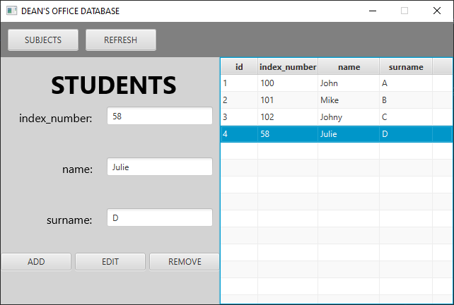
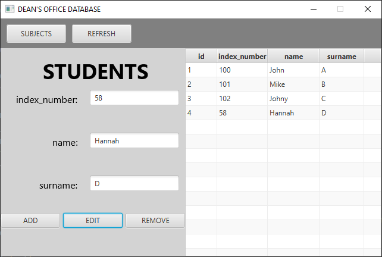
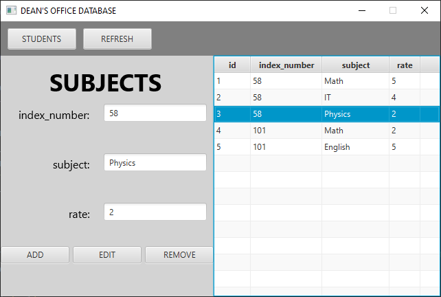
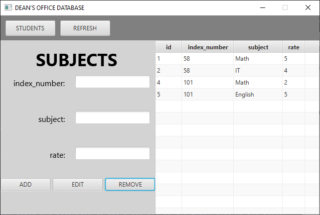
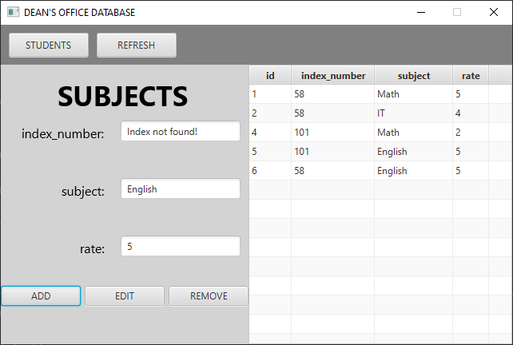

# java-h2db-deans-office

My practice with h2 database and JavaFX to learn more about these technologies.

It is a simple window application that allows to query a database using a form.

There are some SELECT, INSERT, UPDATE, and DELETE queries. You can add a row, edit it by editing the values in the
form at the left side or delete a selected row.

# This is how it looks:
### 1. application started and 4th student selected
  

### 2. 4th student edited (Julie -> Hannah)
  

### 3. subject "Physics" selected
  

### 4. subject "Physics" removed

### 5. subject "English" with rating 5 has been added and attempted to add a subject by the index that no one student has
(index_number in subjects is a FOREIGN key that references index_number in students, so in the students table there 
must 
be a student with a given index_number)

<b>"Index not found!" is displayed in the first field</b>

